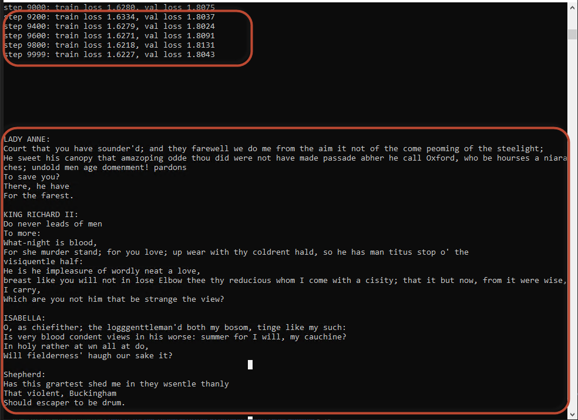

# Background
* We want to read a text from Shakespeare as training dataset:
  * The training dataset is all Shakespeare concatenated together
  * Then, after training, we want to see if our Transformers can generate text similar to Shakespeare.
  * It is based on training transformers
  * We are basically trying to reproduce the GPT2, 2017, with 124M parameters
  * Good Video: https://www.youtube.com/watch?v=kCc8FmEb1nY&t=451s&ab_channel=AndrejKarpathy


# Language Modeling (using nn.transformer and torchtext)

## 1 Goal
The goal is to train a seq-2-seq language model (lm) using nn.transformer. In other words, we want to train a
language model to predict next char in a Shakespear text.

This is an Only-Encoder Transformer model to predict next char. The Encoder only schematic is avilable in the folder 02_Encoder_Only.... folder here.

Training a small model with nearly 18M param, results in below fakly-generated Shakespear text:

```
python3 -m main --log_dir . --n_epochs 10000 --batch_size 128 --emb_size 512 --n_head 8 --n_layer 6

```



