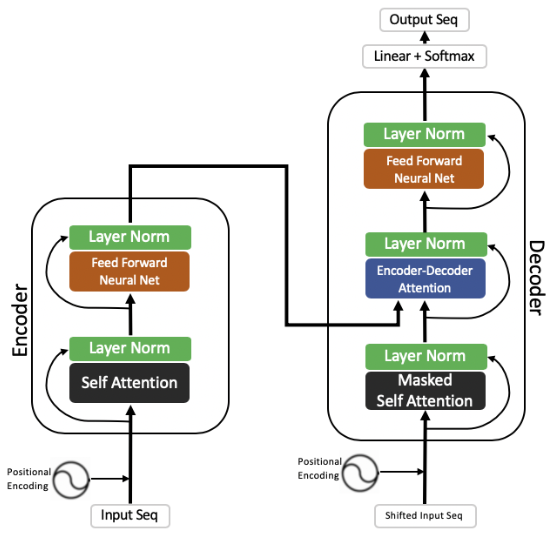
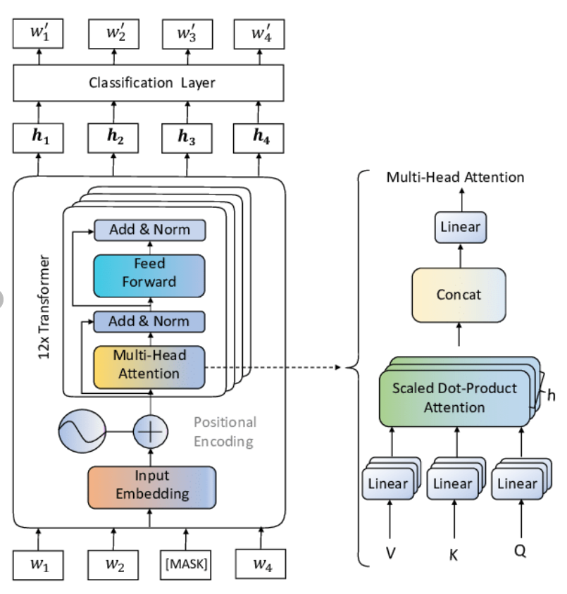
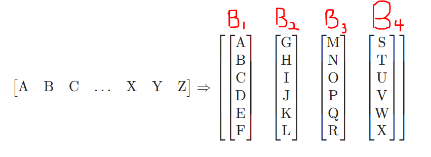
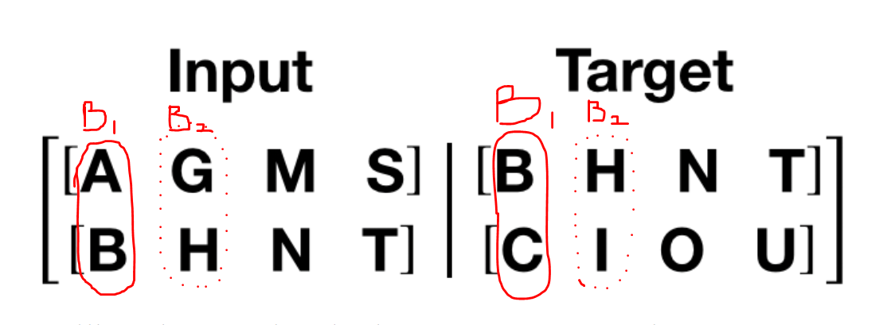

# Language Modeling (using nn.transformer and torchtext)

## 1 Goal
The goal is to train a seq-2-seq language model (lm) using nn.transformer. In other words, we want to train a
language model to predict next word, by feeding Wikipedia sentences (slightly reduced-size of the original
WikiText dataset). 

The nn.Transformer module relies entirely on an attention mechanism implemented as nn.MultiheadAttention.
torchtext features along with nn.Transformer for language modeling via next word prediction!
 
 Also, geart introduction at here: 
 I) https://www.youtube.com/watch?v=dichIcUZfOw&ab_channel=MathofIntelligence
 II) https://www.youtube.com/watch?v=mMa2PmYJlCo&ab_channel=MathofIntelligence
 III) https://www.youtube.com/watch?v=gJ9kaJsE78k&ab_channel=MathofIntelligence
 IV) https://nlp.seas.harvard.edu/2018/04/03/attention.html
 
 Our model, here will be the left hand side of the picture below, with the 
 exception that, we use masked self-attention, so that we can predict a word
 after a given word. 

The picture below is more close to what we do here in this language model. We should also assume "W4" is also Masked, and we want to 
predict the word after "W2". Details of number of heads and various layers might not be excatly as implemented in the code.

## 2 Dataset
The WikiText language modeling dataset is a collection of over 100 million tokens extracted from the set of verified
Good and Featured articles on Wikipedia. The WikiText-2 dataset is a small version of the WikiText-103 dataset as it
contains only 2 million tokens. We want all these sentences next to each other, and then batch them. Afterward, by 
setting a bptt length (back-propagating through time), we analyze it through our lm. 

### 2-1 batching the data:
Let's assume we have nearly ~2,000,000 training sentences in Wikitext2 dataset. if we want them
in 20 batches. We can get all 2 million sentences as one sentences, and then put them all
in 20 columns. In other words, sentences are in batches and each batch is one column.

Once again, if we assume all the training dtaset is considered as a 1-D vector of sequential 
data. In the picture below, each cap-letter represent a word in actual sentences. batchify() method
arranges the data into batch_size columns. If the data does not divide evenly into batch_size
columns, then the data is trimmed to fit. For instance, with the alphabet as the data (total 
length of 26) and batch_size=4, we would divide the alphabet into 4 sequences of length 6, as shown
in picture below:
  

The other paramter to consider here is bptt (back propagation through time) length. In the picture above, 
we assumed all the wikitext is concat to each other, then it is divided into 4 batches (4 columns). Within 
each column what length of sentence do we want to consider (bptt)?? Let's assume we set bptt=5. Then, if
we only consider the first batch (1st column), the source and target sentence will be:
1) src="ABC" --> tgt="BCD"
2) src="DEF" --> tgt="EFG" ==> Though in our example since the length of each batch/column is short "G" 
is impossible for tgt.

Let's repeat the example with bptt = 2. If we only consider the first column/batch in the picture below
 and above:
1) src="AB" --> tgt="BC"
2) src="CD" --> tgt="DE"
1) src="EF" --> tgt="FG"

# 3 Model Architecture

# 3-1 Positional embedding

Great explanation at:

https://datascience.stackexchange.com/questions/51065/what-is-the-positional-encoding-in-the-transformer-model

https://www.youtube.com/watch?v=dichIcUZfOw&ab_channel=MathofIntelligence

#### Reference:
1) https://vaclavkosar.com/ml/transformers-self-attention-mechanism-simplified
2) https://towardsdatascience.com/attention-please-85bd0abac41
3) https://pytorch.org/tutorials/beginner/transformer_tutorial.html#load-and-batch-data
